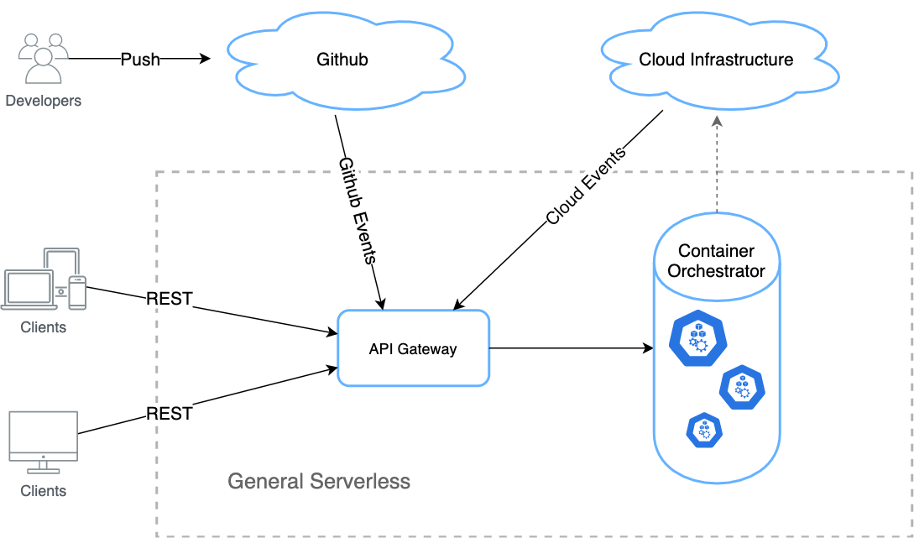

# Sardines Project

# One sentence introduction:
The ***Sardines Project*** is a solution for seamlessly programming distributed systems in a monolithic and synchronous way.

# Relation with Serverless and FaaS
***Sardines*** is a kind of **FaaS**, but not necessarily involves **Serverless**

# Background
[The first prototypical system of Sardines](./[2018]www-bnd-rej.pdf) [[23](#bnd)] (*please excuse the poor writing of this article*) was designed almost at the same time with the incipience of FaaS, which is now largely considered as a synonym of Serverless. While Sardines is  fundamentally different with Serverless, they actually share some basic philosophy about Cloud Computing, e.g., the function level decomposing of cloud application, integration/outsourcing the maintenance of Cloud infrastructure, hoping to provide a powerful interface for developers to efficiently leverage the computing power of cloud. 

## FaaS and Serverless
FaaS, Function-as-a-Service, as Fig 1 illustrated, is a new programming interface that public cloud vendors have recently begun offering under the banner of serverless computing [[1](#2018-one-step-forward)]. 

 
Fig 1: AWS Lambda Official Illustration

In general, as Fig 2 has shown, functions (usually in Node.js/Python/GoLang) are wrapped into containers which composited with full execution stack, triggered by events or direct invocations, and auto-scaled behind an API gateway. Such that in the serverless manner, a function can be independently deployed as an auto-scalable service, outsourcing all the extremely complicated details beyond its business logic to the cloud provider, and charged only for the resources (usually are CPU and memory) actually consumed when it is invoked. 

 
Fig 2: General Serverless Architecture

FaaS was first introduced to the cloud computing market by AWS Lambda in 2014. Then almost all the leading cloud providers announced similar products very quickly, e.g. Google Cloud Functions, MicroSoft Azure Functions, Alibaba Cloud Function, etc. And more akin open source projects emerged, such as Apache Openwhisk, OpenFaaS, Kubeless, Fn, etc. [[2](#2020-faasten)].

The key features of FaaS are: auto-scale, event-driven, stateless, short-lived. Perhaps an usually ignored feature should be added: the inherent dependent on containers. These features might be good or bad, depending on the specific usage scenarios. For the good ones, someone reported it can help to solve resource intensive bioinformatics problems [[3](#2018-biomatic)], and many researches reported deep learning can benefit from serverless [[4](#2018-CLOUD)], [[5](#2019-INFOCOM)], [[6](#2019-IC2E)], and for BigData [[7](#2018-BB)], and for edge computing [[22](#2019-SERVICES)], [[8](#2018-ICFC)], and for IoT [[9](#2018-EUC)], and even in 5G area [[10](#2018-BMSB)].

So far, many concerns about FaaS still remain open, e.g. slow cold-start [[11](#2018-UCC)], I/O bottlenecks, not directly network-addressable, no specialized hardware [[1](#2018-one-step-forward)], a noticeable overhead during the cold-start of a container and when multiple containers are running on the same node, and a significant time to reach stable during a large spike in network requests [[12](#FaaS-Evaluation)], lacking reasonable broad-scope performance evalution [[13](#Journal-SS)]. And FaaS is even doubted of stymieing distributed computing or wheter it is suitable for edge computing [[14](#IS-FAAS-EDGE)]. 

However, many researches addressing these problems are also on the way. Such as a GPU enabled serverless framework which deploy services faster than existing serverless computing framework using CPU [[15](#2018-PDP)]; FnSched, a function-level scheduler designed to minimize provider resource costs while meeting customer performance requirements [[16](#2019-WOSC)]; And in deep learning, there is a generic memory sharing technique TrIMS, that enables constant data to be shared across processes or containers while still maintaining isolation between users, to solve the inefficiency of moving large amount of data within and across server when using FaaS as prediction pipelines [[17](#2019-CLOUD)].

Moreover, FaaS has drew large enthusiasm to increase productivity, such as ToLambda provides automatic conversion of Java monolith application code into AWS Lambda Node.js microservices [[18](#2019-IWoR)], and a dynamic transpiler transforms applications into optimized multi-function serverless orchestrations to increased developer productivity [[19](#2019-FASW)], and TOSCA, an event-driven deployment modeling approach using the standard Topology and Orchestration Specification for Cloud Applications that fully employs the suggested standard lifecycle to provision and manage multi-cloud serverless applications [[20](#2018-SOCA)]. And Anirban et al presented a framework for scheduling multi-function serverless applications over a hybrid public-private cloud to minimizes the cost of public cloud use [[21](#2020-Skedulix)]

In sum, the auto-scalability and the pay-as-you-go manner of serverless computing, together with the great flexibility derived from function-granule isolation, exposed great potential of cloud computing, thereby attracted considerable attention from both academics and industry, in spite of massive limitations of incipient development. As for the relationship between FaaS and Serverless, it might has been a consensus of cloud computing that FaaS is a kind of Serverless, and they might be exchangeable concepts in many cases.

## Does FaaS has to be Serverless?
Literally, the term FaaS, Function-as-a-Service, only tells the story between a function and a service. A bit more specific, considering specific runtime envrionments, such as front-end and back-end, the ecosystems of how a function be used as a service are very much different, just because the term Service would accordingly have fundamentally different runtime definitions. If considered more broadly, as distributed systems becoming pervasive -- from the stand-by data centers, extending to mobile computing, cloud computing, edge computing, IoT, ubiquitous computing -- Service has become one of the most multivocal terms, but in the meanwhile, one of the most essential concepts in computer science. Therefore, if FaaS should be an interchangeable concept of Serverless, is Serverless applicable for all of the other environments mentioned above? If not, does it mean FaaS is a redundant idea out of Serverless? 

Even if focused in the cloud computing area, Serverless is a feature of cloud infrastructure. Without Serverless, a function of cause can be transformed to an online service. The point is, can it auto-scale without Serverless?

## Why choose function as the granularity?
If consider a service as a runtime of source code together with a communication protocol and an address, that the essence form in distributed systems, a service is analogical with a memory block which contains the instructions of a function together with its pointers in the stack, which is usually called an in-memory runtime of a function. And then, FaaS is summarizing the idea of transforming source code into runtimes in distributed systems at the granularity of function. 

Besides the details of implementations in different runtime envrionments, is function a good choice of unit to be mapped as service? Since the Object Oriented system design or programming has been proven far more productive than Function Oriented ones, why don't transform objects instead? That might be far more complicated than just talking about the design of a FaaS framework. Simply put or think straightforwardly, how does objects come to the world without the implement of functions? Further more, objects might be unnecessary in many cases. In short, function is the smallest programming block, it has to be the first step.

# Sardines Perspective
From the view of cloud providers, the serverless is a step forward toward developers, which provides a fine-grained programming interface to integrate the cloud infrastructure into their applications. However it does not narrow the gap impeding developers to leverage the immense computing power of cloud. To ultimately eliminate that gap, and to empower FaaS applicable in more areas of distributed systems other than cloud computing, we adopt the view of developers. Instead of the top-down mindset of cloud providers, the view of developers requires a bottom-up mindset to grow out a whole new ecosystem, from a set of succinct and intuitive programming interfaces.

## Overall Roadmap

### &#9745; Stage 1: Programming Interface Abstraction
From the prospect of developers, the fundamental work is to maintain a set of highly abstract programming interfaces of the distributed systems no matter how the runtime envrionment changes.

### &#9745; Stage 2: Distributed Architecture Oriented Compilation
To transform funtions into service runtimes and keep from the variance of runtime environments, an intermediate representation of service is required, which is independent of any communication protocols. The compiler decomposes source code into a set of functions and then a set of this kind of intermediate representation.

### &#9745; Stage 3: A set of ***Service Providers*** and ***Service drivers*** for communication protocols
A pair of service provider and service driver is used to deploy the intermediate representation of service in a certain runtime environment.

### &#9745; Stage 4: A ***Service Gateway*** and a set of service runtime CRUD tools
Services shall be deployed or removed in a resource pool by a service gateway, which in turns records or deletes the runtime information of services, such as the communication protocol, runtime address, initialization parameters and so on.

### Stage 5: Advanced routing in service gateway
In the numerous scenarios of use cases, the deployment of a service runtime might be very complicated, which might involve reverse proxy, load balancing, route selection, service clusters or logic groups, etc. Therefore, the service runtimes managed by the service gateway also need corresponding routing mechanism, and that will be a responsibility of the service gateway at this time.

### Stage 6: Distributed Data Cells
To access data everywhere from anywhere in a distributed system is too complicated to get perfect solutions. Here we planned to introduce a concept of distributed data cell, and hope to provide a moderate solution in most scenarios.

### Stage 7: Replication and Scaling
So far, the whole system is running in single thread mode. Although there could be some workaround of certain deployment tool, but replication and scaling should be the responsibility of the service gateway, or at least initiated by it. It is the time to consider the Serverless pattern. However, Serverless is not necessarily to be the only solution. It depends on the specific runtime environment and its deployment mechanism.

### Stage 8: Topics of automation
When all of the above are done, we could assume that the pathway between developer and distributed infrastructure is open. While it must be very awful to walk on it for everything by far is basically manual, the point is there is no gap on the way. Based on these manual interfaces, automation could be built. There could be countless topics of automation in almost every aspect of cloud computing, edge computing, IoT, etc. Developers shall only take care of business logics, leaving all the rest to scientists.

# Sardines Code
Currently, Sardines is developed in Typescript (Sardines.js) and is working on stage 5. The reason of firstly using Typescript is simply hope to keep a chance to build services in browsers and mobile devices, and to realize the deployment on heterogeneous infrastructure across both front-end and back-end.

The Sardines.js project contain 7 sub-projects: [Compile Time Tools](https://github.com/robin98sun/sardines.compile-time-tools.js), [Runtime Core](https://github.com/robin98sun/sardines.core.js), [Shoal(the service gateway)](https://github.com/robin98sun/sardines.shoal.js), [HTTP Provider](https://github.com/robin98sun/sardines.service-provider.http.js), [HTTP Driver](https://github.com/robin98sun/sardines.service-driver.http.js), [Built-in Services(for advanced routing and replication)](https://github.com/robin98sun/sardines.built-in-services.js), and [Docker Orchestrator](https://github.com/robin98sun/sardines.docker.js).

## Architecture
To be continued...

# References
1. J. M. Hellerstein, et al., Serverless computing: One step forward, two steps back, arXiv preprint arXiv:1812.03651.
2. Vladimir Yussupov, et al., FaaSten Your Decisions: Classification Framework and Technology Review of Function-as-a-Service Platforms, arXiv:2004.00969.
3. Dimitar Kumanov, et al., Serverless computing provides on-demand high performance computing for biomedical research, arXiv:1807.11659
4. Lang Feng, et al., Exploring Serverless Computing for Neural Network Training, Proceedings of 2018 IEEE 11th International Conference on Cloud Computing (CLOUD).
5. Hao Wang, et al., Distributed Machine Learning with a Serverless Architecture, Proceedings of 2019 IEEE Conference on Computer Communications (INFOCOM).
6. Anirban Bhattacharjee, et al., BARISTA: Efficient and Scalable Serverless Serving System for Deep Learning Prediction Services, Proceedings of 2019 IEEE International Conference on Cloud Engineering (IC2E).
7. Sebastian Werner, et al., Serverless Big Data Processing using Matrix Multiplication as Example, Proceedings of 2018 IEEE International Conference on Big Data (Big Data)
8. Luciano Baresi, et al., Towards a Serverless Platform for Edge Computing, Proceedings of 2019 IEEE International Conference on Fog Computing (ICFC)
9. Duarte Pinto, et al., Dynamic Allocation of Serverless Functions in IoT Environments, Proceedings of 2018 IEEE 16th International Conference on Embedded and Ubiquitous Computing (EUC).
10. Stamatia Rizou, et al., A Service Platform Architecture Enabling Programmable Edge-To-Cloud Virtualization for the 5G Media Industry, Proceedings of 2018 IEEE International Symposium on Broadband Multimedia Systems and Broadcasting (BMSB)
11. Johannes Manner, et al., Cold Start Influencing Factors in Function as a Service, Proceedings of 2018 IEEE/ACM International Conference on Utility and Cloud Computing Companion (UCC Companion).
12. PranjalGupta, ShreeshaAddala, Experimental Evaluation of Serverless Functions, https://g31pranjal.github.io/assets/serverless-report.pdf
13. Joel Scheuner, Philipp Leitner, Function-as-a-Service performance evaluation: A multivocal literature review, Journal of Systems and Software, Volume 170, December 2020, 110708.
14. Runyu Jin, Qirui Yang, and Ming Zhao, Is FaaS Suitable for Edge Computing?, https://www.usenix.org/system/files/hotedge20_poster_jin.pdf
15. Jaewook Kim, et al., GPU Enabled Serverless Computing Framework, Proceedings of 2018 26th Euromicro International Conference on Parallel, Distributed and Network-based Processing (PDP).
16. Amoghvarsha Suresh, Anshul Gandhi, FnSched: An Efficient Scheduler for Serverless Functions
Share on, Proceedings of the 5th International Workshop on Serverless ComputingDecember (WOSC) 2019 Pages 19–24https://doi.org/10.1145/3366623.3368136.
17. Abdul Dakkak, et al., TrIMS: Transparent and Isolated Model Sharing for Low Latency Deep Learning Inference in Function-as-a-Service, Proceedings of 2019 IEEE 12th International Conference on Cloud Computing (CLOUD).
18. Alex Kaplunovich, ToLambda-Automatic Path to Serverless Architectures, Proceedings of 2019 IEEE/ACM 3rd International Workshop on Refactoring (IWoR).
19. Joel Scheuner, Philipp Leitner, Transpiling Applications into Optimized Serverless Orchestrations, Proceedings of 2019 IEEE 4th International Workshops on Foundations and Applications of Self* Systems (FAS*W).
20. Michael Wurster, et al., Modeling and Automated Deployment of Serverless Applications Using TOSCA, Proceedings of 2018 IEEE 11th Conference on Service-Oriented Computing and Applications (SOCA).
21. Anirban Das, et al., Skedulix: Hybrid Cloud Scheduling for Cost-Efficient Execution of Serverless Applications, arXiv:2006.03720.
22. Andrei Palade, Aqeel Kazmi, Siobhán Clarke, An Evaluation of Open Source Serverless Computing Frameworks Support at the Edge, Proceedings of 2019 IEEE World Congress on Services (SERVICES).
23. Lin Sun, BND: A Free-to-Decompose Function-as-a-Service Application Framework, https://github.com/robin98sun/sardines.io/blob/master/%5B2018%5Dwww-bnd-rej.pdf